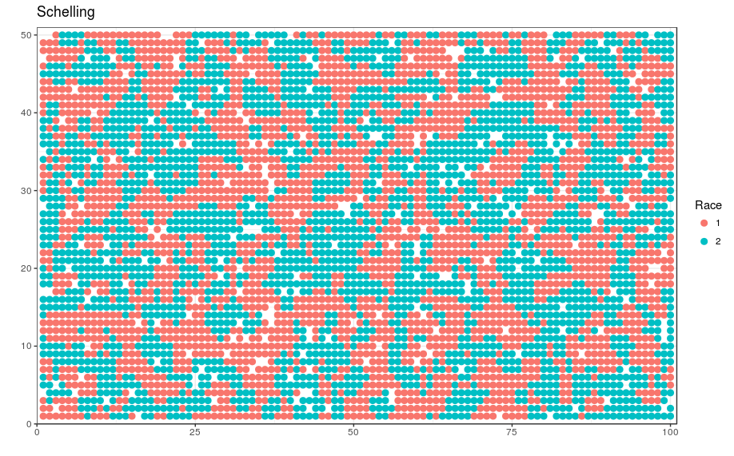

# Schelling Simulation

This repository holds my Undergraduate Economic Thesis for the University of Chicago in 2016. I refactored the original code and app so that now the code follows a tidy-styled API and is faster. The old code can be found [here](https://github.com/badbayesian/schelling_extension/blob/old/schelling_old.R).

The Shiny App can be found [here.](https://badbayesian.shinyapps.io/schelling/)

If you want to run the Schelling code locally you can copy the following.
There are three major functions which define the schelling process in the code: 'init_board()', 'schelling()', and 'plot_board()'
```r
board <- init_board(height = 50, width = 100, race_distribution = c(0.5, 0.5), filled = 0.95) %>%
          schelling(tolerance = 0.33)

plot_board(board)
```


The paper can be found [here](https://github.com/badbayesian/schelling_extension/blob/master/Thesis/Silva-Inclan%20-%202016%20-%20Schelling%20Index%20Measuring%20Decentralized%20Racism%20in%20the%20Chicago%20Housing%20Market.pdf)

Abstract:

This paper models decentralized segregation through a hybrid of a simple housing model and Schelling sorting in Chicago. Using Census tract data and Racial Isolation and Racial Dissimilarity indices, I estimate a racial tolerance level for Chicago in 2000 and 2010. To achieve similar levels of segregation in Chicago for both years on average, the tolerance level required is at least 50%, which is in line with actual surveyed tolerance levels.  Consequently, there is some evidence that racial attitudes in Chicago have not changed significantly between 2000 and 2010. This is evidence that racial segregation is perpetuated by a decentralized racism, where White people pay a premium to live in a predominately White neighborhood, rather than by legal barriers, as suggested in Cutler, Glaeser, and Vigdor (1999).
